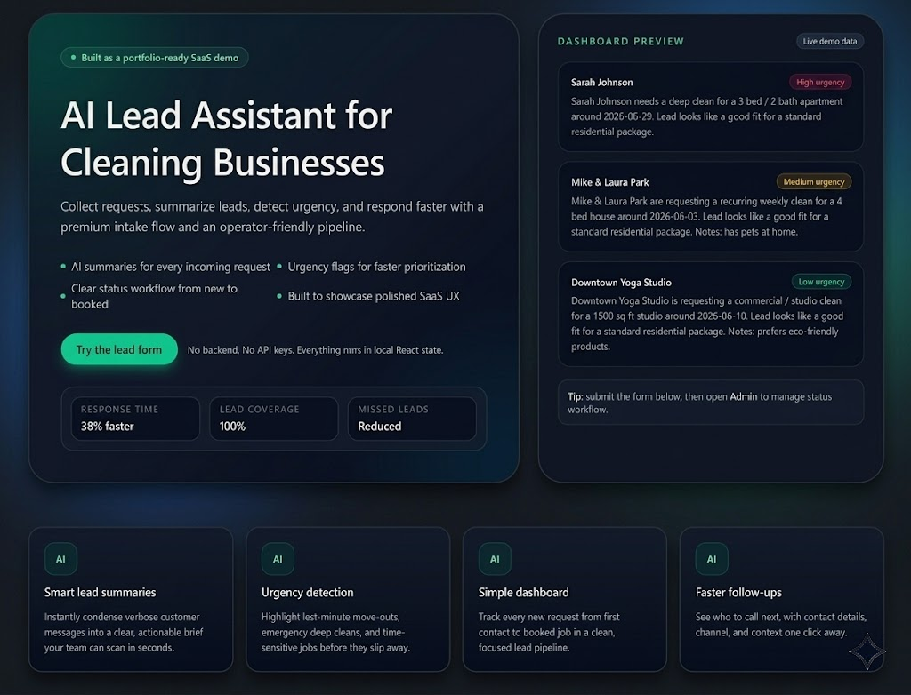
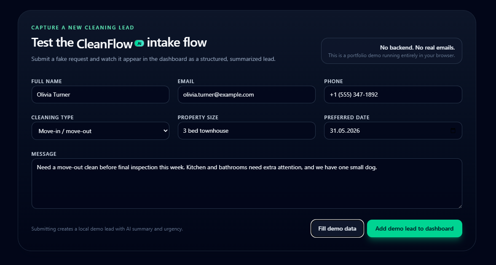
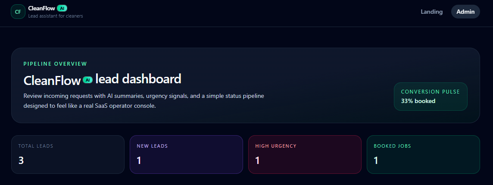
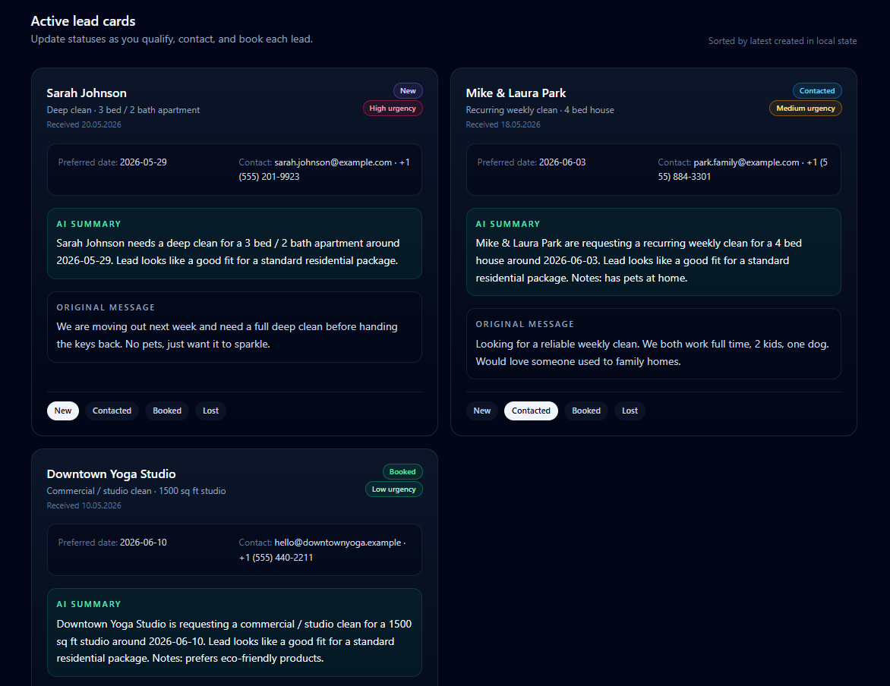
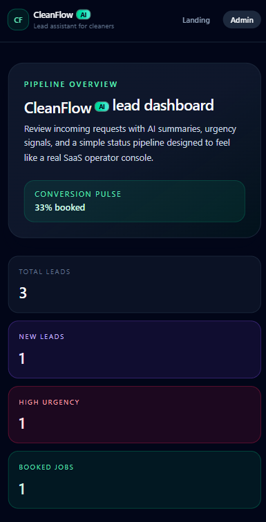

# CleanFlow AI

CleanFlow AI is a portfolio demo of an AI-powered lead assistant for small cleaning businesses.  
It helps collect customer requests, generate AI-style summaries, detect urgency, and manage leads in a simple dashboard.

## 1. Overview


CleanFlow AI is a frontend-only MVP that demonstrates how a modern SaaS workflow can look for service-based businesses.  
The current version focuses on user experience, lead intake flow, and dashboard usability.

## Screenshots

### Landing Page



### Lead Intake Form



### Admin Dashboard



### Lead Cards



### Mobile View



## 2. Problem

Small cleaning businesses often receive leads from different channels and handle them manually.  
This makes follow-ups slower, prioritization harder, and potential bookings easier to miss.

## 3. Solution

CleanFlow AI provides a clean intake form and an admin dashboard that organizes each request with:

- structured lead data
- AI-style summary text
- urgency level (Low / Medium / High)
- lead status workflow (New, Contacted, Booked, Lost)

## 4. Features

- Landing page with product-style presentation
- Lead capture form for customer requests
- Local summary generation (mock AI behavior)
- Urgency detection using local logic
- Admin dashboard with lead cards
- Status update actions for each lead
- Responsive interface for desktop and mobile

## 5. Tech Stack

- React
- Vite
- Tailwind CSS
- Local React state
- Mock data

This is a frontend-only MVP:

- No backend yet
- No real AI API yet

## 6. Demo Flow

1. Open the landing page.
2. Submit a lead using the form.
3. The app creates a lead object in local state.
4. A local AI-style summary is generated.
5. Urgency is automatically assigned.
6. Open the Admin view to manage the new lead and update status.

## 7. Current Limitations

- Data is not persisted (refresh resets state to mock data).
- No backend/database integration.
- No real AI model integration.
- No authentication or user roles.
- No notifications or external integrations.

## 8. Future Improvements

- Supabase database
- OpenAI API integration
- Email/Telegram notifications
- Authentication
- Lead filtering and search
- Deployment to Vercel

## 9. How to Run Locally

```bash
npm install
npm run dev
```

Then open the local Vite URL shown in the terminal (usually `http://localhost:5173`).

## Live Demo
https://твоя-ссылка.vercel.app
